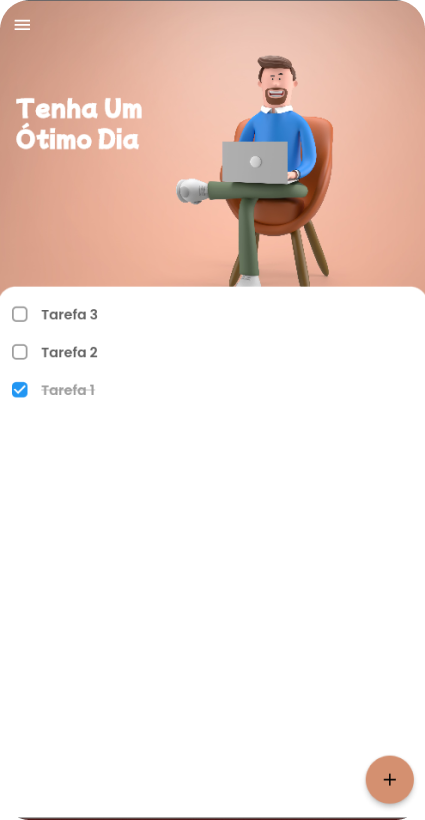
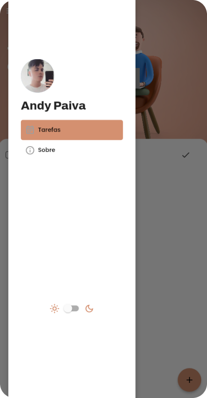
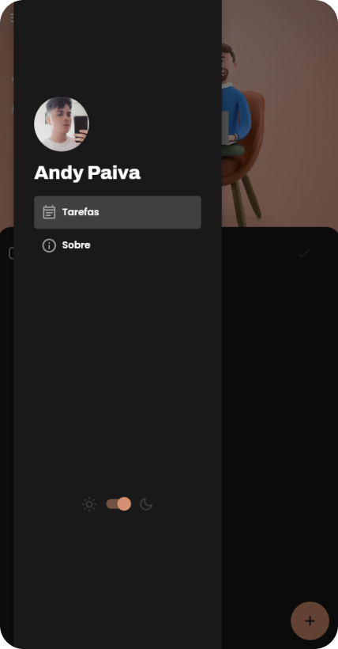

# App-To-Do
App feito em flutter para gerenciar tarefas.

Criado para fixar o aprendizado em Flutter, utilizando SharedPreferences e Provider, o app é 100% funcional para criar lista de tarefas, com capacidade de armazenar e excluir as atividades. Também possui dark mode!

